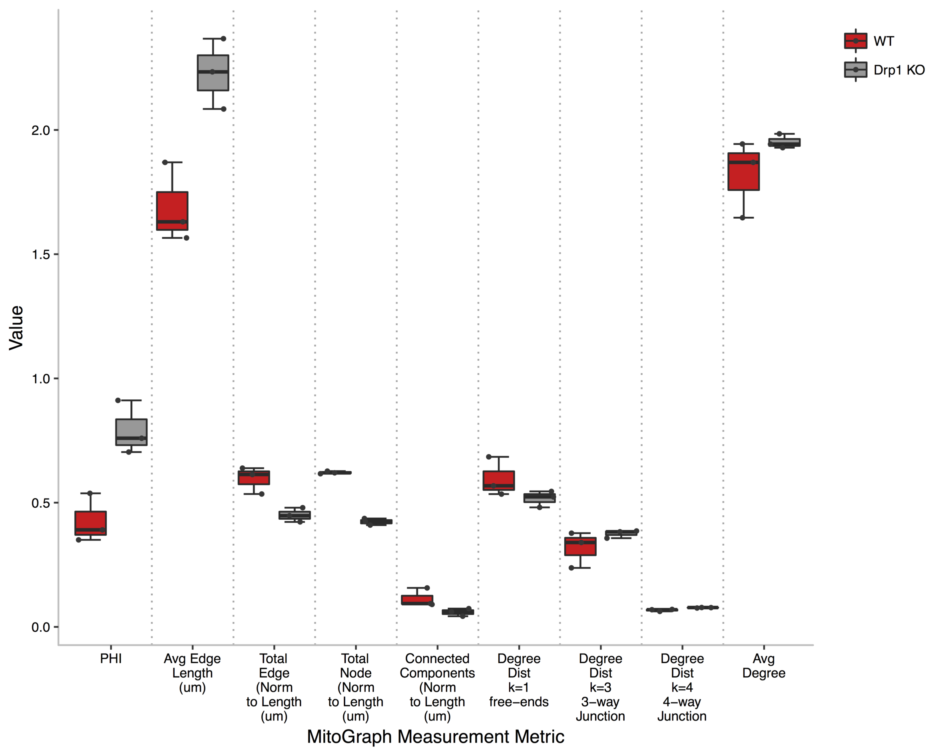

# MitoGraph-Contrib-RScripts

Here we provide an example dataset of mammalian cells and R scripts created to assist you to analyze and plot the data produced by <a href="https://github.com/vianamp/MitoGraph">MitoGraph</a>. Example of plot:

<p align="center">
  
</p>

## Download

<a href="https://github.com/Hill-Lab/MitoGraph-Contrib-RScripts/archive/v1.0.zip">Click here to download our example dataset and R scripts</a>. We recommend you to unzip the file in your Desktop.

## How to Run MitoGraph on the example dataset

To execute MitoGraph on our test dataset, type the following command in the terminal of your Mac OS (spotlight + terminal):

```
cd ~/Desktop/MitoGraph
./MitoGraph -xy 0.1667 -z 0.2 -scales 1.0 1.3 4 -adaptive 10 -path ~/Desktop/MitoGraph-Contrib-RScripts-1.0/samples
```

## How to use our scripts

Before running our scripts, make sure you have __R__ or __R Studio__ installed in your system as well as the packages __igraph__, __ggplot2__, __reshape2__, __formattable__ and __RColorBrewer__ installed.

1. If you are using _R_, go to `File -> Source File` and select `CreateSummary.R`. If you are using __R Studio__, open the file `CreateSummary.R` and hit Shift + ⌘ + S.

2. The script will ask for folder where the `.gnet` files produced by MitoGraph are stored. Type `~/Desktop/MitoGraph-Contrib-RScripts-1.0/samples` hit return.

3. Add a column called _Condition_ in the file `output-summary.csv` created in the previous step and fill with the corresponding cell condition.

4. If you are using _R_, go to `File -> Source File` and select `CreatePlots.R`. If you are using __R Studio__, open the file `CreatePlots.R` and hit Shift + ⌘ + S.

5. The script will ask for folder where the `.gnet` files produced by MitoGraph are stored. Type `~/Desktop/MitoGraph-Contrib-RScripts-1.0/samples` and hit return.

## Output files

Missing brief description here

